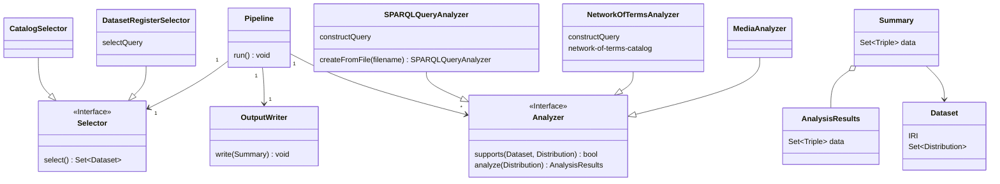

# Technical design

* Two selection modes:
    * efficient, narrow selection by Selector
    * wider selection combined with flexibility of `Analyzer::supports(Dataset, Distribution)`
* NetworkOfTermsAnalyzer gets catalog
    * from `@netwerk-digitaal-erfgoed/network-of-terms-catalog` package
    * or by querying Dataset Register for terminology sources and their prefixes.
* Use `nde:graphUri` and `nde:subjectFilter` or a more generic approach such as `nde:baseQuery`?
* AnalysisResults is a `void:Dataset` that will be contained through `void:subset` in the Summary. So Summary
  = `void:Dataset` that has `void:subset` each of the AnalysisResults. See
  also [Data model for results](https://github.com/netwerk-digitaal-erfgoed/kg-pipeline/issues/11).
* If we place each Summary in its own named graph, we can easily replace that graph with an updated Summary. We do need
  to merge AnalysisResults (multiple `void:Dataset` statements) into a single Summary.
* Run Pipeline in NDE infrastructure. If we add more Kubernetes nodes (currently 2), add a worker pool to parallelize
  workloads.
